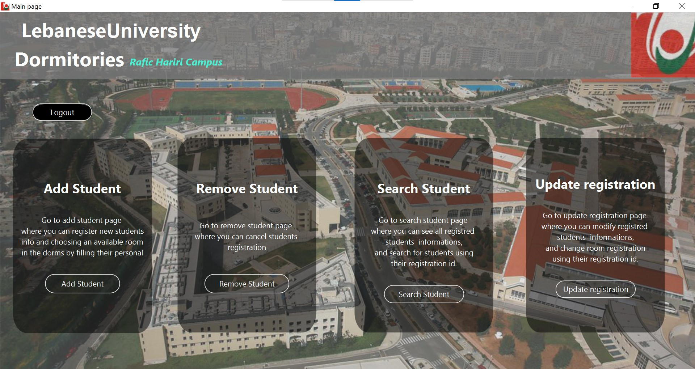
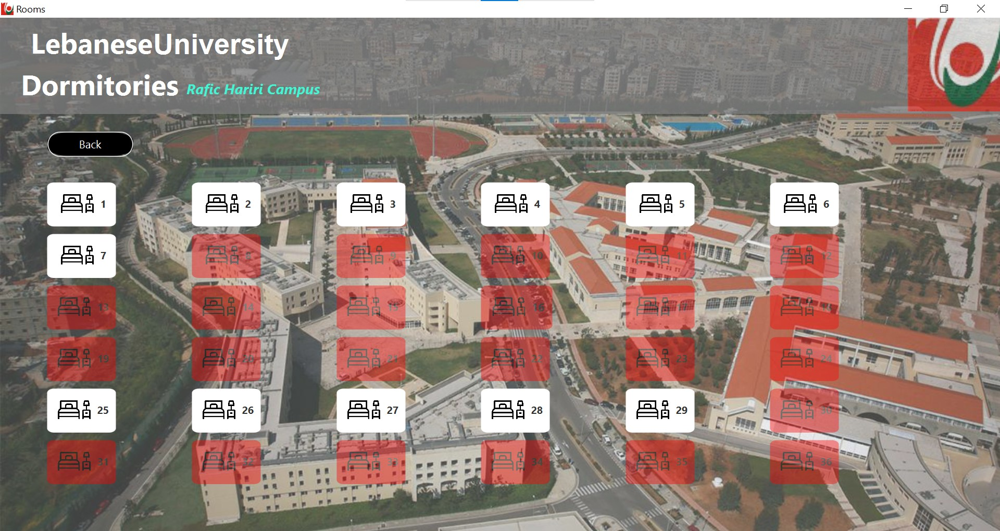

# Dorms-Registration-system
This is a javafx fxml app, created in the context of a university project, the app is written in **java** applying the MVC design pattern, i used mysql as a DBMS, and  the scenebuilder tool for the GUI.
### Functionality
This app provides CRUD(create, read, update, delete) operations for the administrator, the goal is to be able to handle the data of students registred in the dorms and store them in a secure database.

The app is based on the Lebanese University dorms model, where 7 blocks are available (A,B,C,D,E:for female students, F,G:for male students) the admin has to fill in the students info and based on them he will be presented the corresponding blocks available for the students to choose from, and then choose from the available floors and rooms. Every block has 4 floors with 36 rooms in each of these floors.

